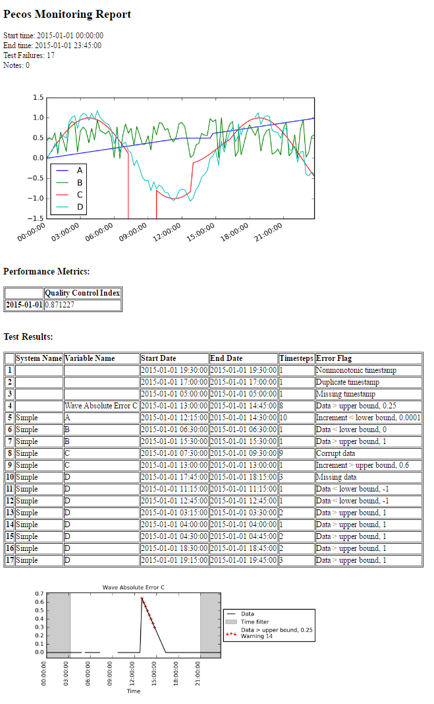

.. _results:

Results
==========

Pecos can be used to collect quality control test results and performance metrics, and generate HTML reports and dashboards.

Quality control test results
------------------------------

When a quality control test fails, information is stored in::

	pm.test_results

Test results includes the following information:

* Variable Name: Column name in the DataFrame

* Start Date: Start time of the failure

* End Date: : End time of the failure

* Timesteps: The number of consecutive time steps involved in the failure

* Error Flag: Error messages include:

  * Duplicate timestamp
 
  * Nonmonotonic timestamp
 
  * Missing data (used for missing data and missing timestamp)
 
  * Corrupt data
 
  * Data < lower bound OR Data > upper bound
 
  * Increment < lower bound OR Increment > upper bound
 
  * Delta < lower bound OR Delta > upper bound
  
  * Outlier < lower bound OR Outlier > upper bound

A subset of quality control test results from the :ref:`simple_example` are shown below.

.. doctest::
    :hide:

    >>> import pandas as pd
    >>> pd.set_option('display.expand_frame_repr', False)
    >>> from os.path import abspath, dirname, join
    >>> import pecos
    >>> docdir = dirname(abspath(__file__))
    >>> datadir = join(docdir,'..','pecos', 'tests', 'data')
	>>> pm = pecos.monitoring.PerformanceMonitoring()
    >>> test_results = pd.read_csv(join(datadir,'Simple_test_results.csv'), index_col=0) # This file is tested against output from the Simple example
    >>> pm.test_results = test_results.loc[0:7,:]	

.. doctest::

    >>> print(pm.test_results)
      Variable Name      Start Date        End Date  Timesteps                         Error Flag
    1           NaN   1/1/2015 5:00   1/1/2015 5:00          1                  Missing timestamp
    2           NaN  1/1/2015 17:00  1/1/2015 17:00          1                Duplicate timestamp
    3           NaN  1/1/2015 19:30  1/1/2015 19:30          1             Nonmonotonic timestamp
    4             A  1/1/2015 12:15  1/1/2015 14:30         10  |Increment| < lower bound, 0.0001
    5             B   1/1/2015 6:30   1/1/2015 6:30          1              Data < lower bound, 0
    6             B  1/1/2015 15:30  1/1/2015 15:30          1              Data > upper bound, 1
    7             C   1/1/2015 7:30   1/1/2015 9:30          9                       Corrupt data

Note that variable names are not recorded for timestamp test failures (Test results 1, 2, and 3).
	
The :class:`~pecos.io.write_test_results` method is used to write quality control test results to a CSV file.
This method can be customized to write quality control test results to a database or to other file formats.

Performance metrics
-----------------------------

The :class:`~pecos.io.write_metrics` method is used to write performance metrics to a CSV file.
This method can be customized to write performance metrics to a database or to other file formats.
The method can be called multiple times to appended metrics based on the timestamp of the DataFrame.
:numref:`fig-metrics` shows a simple example where two metrics DataFrames are appended in a single file.

.. doctest::
    :hide:

    >>> metrics_day1 = pd.DataFrame(index=[pd.Timestamp('2018-1-1')])
    >>> metrics_day1['QCI'] = 0.871
    >>> metrics_day1['RMSE'] = 0.952
    >>> metrics_day2 = pd.DataFrame(index=[pd.Timestamp('2018-1-2')])
    >>> metrics_day2['QCI'] = 0.755
    >>> metrics_day2['RMSE'] = 0.845
	
.. doctest::

    >>> print(metrics_day1)
                  QCI   RMSE
    2018-01-01  0.871  0.952
    >>> print(metrics_day2)
                  QCI   RMSE
    2018-01-02  0.755  0.845
    >>> pecos.io.write_metrics('metrics_file.csv', metrics_day1)
    >>> pecos.io.write_metrics('metrics_file.csv', metrics_day2)

The metrics_file.csv file will contain::

                  QCI   RMSE
    2018-01-01  0.871  0.952
    2018-01-02  0.755  0.845
   
.. _monitoring_reports:

Monitoring reports
-------------------------------

The :class:`~pecos.io.write_monitoring_report` method is used to generate a HTML monitoring report.
The monitoring report includes the start and end time for analysis, custom graphics 
and performance metrics, a table that includes test results, graphics associated 
with the test results (highlighting data points that failed a quality control tests), 
notes on runtime errors and warnings, and the configuration options 
used in the analysis.

* **Custom Graphics:**
  Custom graphics can be created for specific applications.  These graphics 
  are included at the top of the report.
  Custom graphics can be generated using methods in the :class:`~pecos.graphics` module.

* **Performance Metrics:**
  Performance metrics are displayed in a table.

* **Test Results**
  Test results contain information stored in pm.test_results.
  Graphics follow that display the data point(s) that caused the failure.  
  Test results graphics are generated using the :class:`~pecos.graphics.plot_test_results` method.
  
* **Notes:**
  Notes include Pecos runtime errors and warnings.  Notes include:
  
  * Empty/missing data
  * Formatting error in the translation dictionary
  * Insufficient data for a specific quality control test
  * Insufficient data or error when evaluating string

* **Configuration Options:**
  Configuration options used in the analysis.

:numref:`fig-monitor-2` shows the monitoring report from the :ref:`simple_example`. 

.. _fig-monitor-2:

   
   Example monitoring report.

.. _dashboards:
   
Dashboards
-----------

To compare quality control analysis across several systems, key graphics and metrics
can be gathered in a dashboard view.  
For example, the dashboard can contain multiple rows (one for each system) and multiple columns (one for each location).  
The dashboard can be linked to monitoring reports and interactive graphics for more detailed information.
The :class:`~pecos.io.write_monitoring_report` method is used to generate a HTML dashboard.

For each row and column in the dashboard, the following information can be specified

* Text (i.e. general information about the system/location)

* Graphics (i.e. a list of custom graphics)

* Table (i.e. a Pandas DataFrame with performance metrics)

* Links (i.e. the path to a monitoring report or other file/site for additional information)

Text, graphics, tables, and links can be combined to create custom dashboards.
Pecos includes dashboard examples (**dashboard_example_1.py**, **dashboard_example_2.py**, and 
**dashboard_example_3.py**) in the examples/dashboard directory.
:numref:`fig-dashboard1`, :numref:`fig-dashboard2`, and  :numref:`fig-dashboard3` show example dashboards generated using Pecos.

.. _fig-dashboard1:
.. figure:: figures/dashboard1.png
   :scale: 75 %
   :alt: Dashboard1
   
   Example dashboard 1.
   
.. _fig-dashboard2:
.. figure:: figures/dashboard2.png
   :scale: 75 %
   :alt: Dashboard
   
   Example dashboard 2.
 
.. _fig-dashboard3:
.. figure:: figures/dashboard3.png
   :scale: 85 %
   :alt: Dashboard
   
   Example dashboard 3.

Graphics
-----------
The :class:`~pecos.graphics` module contains several methods to plot time series data, scatter plots, heatmaps, 
and interactive graphics. These methods can be used to generate graphics that are included in 
monitoring reports and dashboards, or to generate stand alone graphics.  The following figures 
illustrate graphics created using the methods included in Pecos.  
Note that many other graphing options are available using Python graphing packages directly.

Test results graphics, generated using :class:`~pecos.graphics.plot_test_results`, include 
time series data along with a shaded time filter and quality control test results.
The following figure shows inverter efficiency over the course of 1 day.  
The gray region indicates times when sun elevation is < 20 degrees. 
This region is eliminated from quality control tests. Green marks identify data points 
that were flagged as changing abruptly, red marks identify data points that were outside expected range.
These graphics can be included in :ref:`monitoring_reports`.
 
.. _fig-test-results:
.. figure:: figures/test_results_IE.png
   :scale: 50 %
   :alt: test-results
   
   Example test results graphic.

Day-of-year vs. time-of-day heatmaps, generated using :class:`~pecos.graphics.plot_doy_heatmap`, 
can help identify missing data, trends, define filters and define quality control test thresholds when working with large data sets.
The following figure shows irradiance over a year with the time of sunrise and sunset for each day.
The white vertical line indicates one day of missing data.
The method :class:`~pecos.graphics.plot_heatmap` can be used to create simple heatmaps.
These plots can be included as custom graphics in :ref:`monitoring_reports` and :ref:`dashboards`.

.. _fig-doy-heatmap:
.. figure:: figures/heatmap.png
   :scale: 25 %
   :alt: DOY heatmap
   
   Example day-of-year vs. time of day heatmap.

Interactive graphics, generated using :class:`~pecos.graphics.plot_interactive_time series`, 
are HTML graphic files which the user can scale and hover over to visualize data.  
The following figure shows an image of an interactive graphic. Many more options are available, 
see https://plot.ly for more details.  
Interactive graphics can be linked to :ref:`dashboards`.

.. _fig-plotly:
.. figure:: figures/plotly.png
   :scale: 50%
   :alt: Plotly
   
   Example interactive graphic using plotly.
