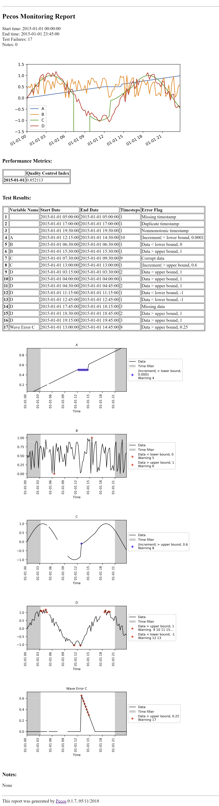

.. _results:

Results
==========

Pecos can be used to collect quality control test results and performance metrics, and generate HTML reports and dashboards.

Quality control test results
------------------------------

When a quality control test fails, information is stored in::

	pm.test_results

Test results includes the following information:

* System Name: System name associated with the DataFrame

* Variable Name: Column name in the DataFrame

* Start Date: Start time of the failure

* End Date: : End time of the failure

* Timesteps: The number of consecutive timesteps involved in the failure

* Error Flag: Error messages include:

  * Duplicate timestamp
 
  * Nonmonotonic timestamp
 
  * Missing data (used for missing data and missing timestamp)
 
  * Corrupt data
 
  * Data > upper bound, value
 
  * Data < lower bound, value
 
  * Increment > upper bound, value
 
  * Increment < lower bound, value

The :class:`~pecos.io.write_test_results` method is used to write quality control test results to a CSV file.
This method can be customized to write quality control test results to a database or to other file formats.
:numref:`fig-test_results` shows a subset of quality control test results from the :ref:`simple_example`.

.. _fig-test_results:
.. figure:: figures/test_results.png
   :scale: 75 %
   :alt: Test results
   
   Example quality control test results.

Note that system and variable names are not recorded for timestamp test failures (Test results 1, 2, and 3) and 
system names are not recorded for composite signals (Test result 4).

Performance metrics
-----------------------------

The :class:`~pecos.io.write_metrics` method is used to write performance metrics to a CSV file.
This method can be customized to write performance metrics to a database or to other file formats.
The method can be called multiple times to appended metrics based on the timestamp of the DataFrame.
:numref:`fig-metrics` shows a simple example where two metrics DataFrames are appended in a single file.

.. _fig-metrics:
.. figure:: figures/metrics_to_file.png
   :scale: 65 %
   :alt: Metrics
   
   Example metrics from two analysis, appended in a file.
   
Monitoring report
-------------------------------

The :class:`~pecos.io.write_monitoring_report` method is used to generate a HTML monitoring report.
The monitoring report includes the start and end time for analysis, custom graphics 
and performance metrics, a table that includes test results, graphics associated 
with the test results (highlighting data points that failed a quality control tests), 
notes on runtime errors and warnings, and the configuration options 
used in the analysis.

* **Custom Graphics:**
  Custom graphics can be created for specific applications.  These graphics 
  are included at the top of the report.

* **Performance Metrics:**
  Performance metrics are displayed in a table.

* **Test Results**
  Test results contain information stored in pm.test_results.
  Graphics follow that display the data point(s) that caused the failure.  

* **Notes:**
  Notes include Pecos runtime errors and warnings.  Notes include:
  
  * Empty/missing data
  * Formatting error in the translation dictionary
  * Insufficient data for a specific quality control test
  * Insufficient data or error when evaluating string

* **Configuration Options:**
  Configuration options used in the analysis.

:numref:`fig-monitor` shows a subset of the monitoring report from the :ref:`simple_example`. 

.. _fig-monitor:

   
   Example monitoring report (subset).
   
Dashboards
-----------

To compare quality control analysis across several systems, key graphics and metrics
can be gathered in a dashboard view.  
For example, the dashboard can contain multiple rows (one for each system) and multiple columns (one for each location).  
The dashboard can be linked to specific monitoring reports for more detailed information.
The :class:`~pecos.io.write_monitoring_report` method is used to generate a HTML dashboard.

For each row and column in the dashboard, the following information can be specified

* Text (i.e. general information about the system/location)

* Graphics (i.e. a list of custom graphics)

* Table (i.e. a Pandas DataFrame with performance metrics)

* Links (i.e. the path to a monitoring report or other file/site for additional information)

Pecos includes dashboard examples, **dashboard_example_1.py** and **dashboard_example_2.py**, in the examples/dashboard directory.
:numref:`fig-dashboard1` and :numref:`fig-dashboard2` show example dashboards generated using Pecos.

.. _fig-dashboard1:
.. figure:: figures/dashboard1.png
   :scale: 75 %
   :alt: Dashboard1
   
   Example dashboard 1.
   
.. _fig-dashboard2:
.. figure:: figures/dashboard2.png
   :scale: 75 %
   :alt: Dashboard
   
   Example dashboard 2.
 